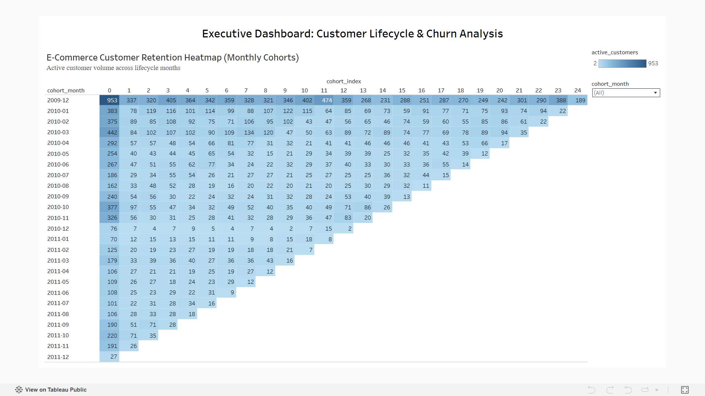

# E-Commerce Customer Retention & Cohort Analysis

This project analyzes transactional data from an online retail platform to evaluate customer retention trends and lifecycle dynamics across monthly cohorts.

Interactive Dashboard: [Live Tableau Link](https://public.tableau.com/views/E-CommerceCustomerLifecycleCohortRetentionAnalytics/Dashboard1?:language=en-US&publish=yes&:sid=&:redirect=auth&:display_count=n&:origin=viz_share_link)

---

## Overview
The goal of this analysis is to measure how customer retention changes over time and identify critical drop-off points in the customer lifecycle. 

Raw transaction records were cleaned and modeled into a cohort matrix using SQLite, and the aggregated results were visualized as an interactive heatmap in Tableau.

---

## Dashboard Preview

---

## Data Pipeline & Modeling (SQL)
1. **Data Cleaning:** Excluded cancelled orders (`C%`), transactions with non-positive price/quantity values, records with missing customer IDs, and wholesale outliers (>500 units).
2. **First Purchase (Cohort Month):** Extracted the initial acquisition month for each customer using aggregation.
3. **Cohort Index Calculation:** Calculated the monthly offset between subsequent transactions and the initial acquisition month:
   * Formula: `Cohort Index = (Tx_Year - First_Year) * 12 + (Tx_Month - First_Month)`
4. **Aggregation:** Grouped the transactions by `cohort_month` and `cohort_index` to compute unique active customer counts and total revenue per cell.

---

## Key Findings
* **Initial Drop-off (Month 1):** The sharpest decline in customer activity occurs between Month 0 and Month 1, with roughly 65-75% of new users churning before making a second purchase.
* **Retention Stabilization:** Retention rates plateau after Month 3, showing a dedicated group of recurring buyers with consistent purchase behavior.

---

## Tech Stack
* **SQL:** SQLite (DBeaver)
* **Visualization:** Tableau Public
* **Files in Repository:**
  * `cohort_analysis.sql` - End-to-end data transformation query
  * `cohort_summary.csv` - Final aggregated output used in Tableau
  * `dashboard_preview.png` - Preview screenshot of the Tableau dashboard
